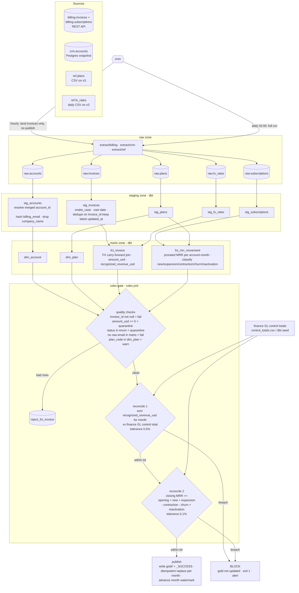

# Data flow — project2

```mermaid
flowchart TD
    subgraph sources[Sources]
        BILL[(billing.invoices +<br/>billing.subscriptions<br/>REST API)]
        CRM[(crm.accounts<br/>Postgres snapshot)]
        PLANS[ref.plans<br/>CSV on s3]
        FX[ref.fx_rates<br/>daily CSV on s3]
    end

    CRON{{cron}}
    CRON -->|hourly: land invoices only, no publish| EXT
    CRON -->|daily 02:00: full run| EXT

    subgraph raw[raw zone]
        EXT[extract/billing · extract/crm · extract/ref]
        EXT --> R1[(raw.invoices)]
        EXT --> R2[(raw.subscriptions)]
        EXT --> R3[(raw.accounts)]
        EXT --> R4[(raw.plans)]
        EXT --> R5[(raw.fx_rates)]
    end

    subgraph staging[staging zone · dbt]
        R1 --> S1[stg_invoices<br/>snake_case · cast date ·<br/>dedupe on invoice_id keep latest updated_at]
        R2 --> S2[stg_subscriptions]
        R3 --> S3[stg_accounts<br/>resolve merged account_id ·<br/>hash billing_email · drop company_name]
        R4 --> S4[stg_plans]
        R5 --> S5[stg_fx_rates]
    end

    subgraph marts[marts zone · dbt]
        S4 --> D2[dim_plan]
        S3 --> D1[dim_account]
        S1 --> F1[fct_invoice<br/>FX carry-forward join · amount_usd ·<br/>recognized_revenue_usd]
        S5 --> F1
        S2 --> F2[fct_mrr_movement<br/>prorated MRR per account-month ·<br/>classify new/expansion/contraction/churn/reactivation]
        S4 --> F2
    end

    D1 --> GATE
    D2 --> GATE
    F1 --> GATE
    F2 --> GATE

    subgraph rulesgate[rules gate · rules.yml]
        GATE{quality checks<br/>invoice_id not null = fail<br/>amount_usd >= 0 = quarantine<br/>status in enum = quarantine<br/>no raw email in marts = fail<br/>plan_code in dim_plan = warn}
        GATE -->|bad rows| REJ[(reject_fct_invoice)]
        GATE -->|clean| RECON1{reconcile 1<br/>sum recognized_revenue_usd for month<br/>vs finance GL control total<br/>tolerance 0.5%}
        RECON1 -->|within tol| RECON2{reconcile 2<br/>closing MRR ==<br/>opening + new + expansion<br/>- contraction - churn + reactivation<br/>tolerance 0.1%}
    end

    GL[finance GL control totals<br/>control_totals.csv / dbt seed] --> RECON1
    GL --> RECON2

    RECON2 -->|within tol| PUB[publish<br/>write gold/ + _SUCCESS ·<br/>idempotent replace per month ·<br/>advance month watermark]
    RECON1 -->|breach| BLOCK[BLOCK<br/>gold not updated · exit 1 · alert]
    RECON2 -->|breach| BLOCK
```
