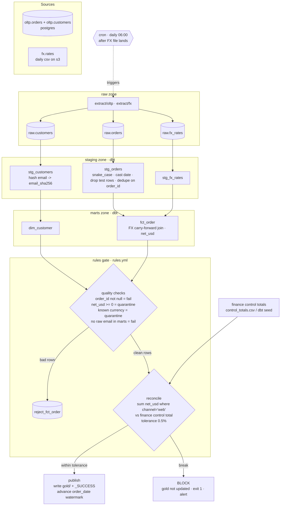

# Data flow — retail_demo

```mermaid
flowchart TD
    subgraph sources[Sources]
        OLTP[(oltp.orders + oltp.customers<br/>postgres)]
        FX[fx.rates<br/>daily csv on s3]
    end

    CRON{{cron · daily 06:00<br/>after FX file lands}}
    CRON -.triggers.-> EXT

    subgraph raw[raw zone]
        EXT[extract/oltp · extract/fx] --> R1[(raw.orders)]
        EXT --> R2[(raw.customers)]
        EXT --> R3[(raw.fx_rates)]
    end

    subgraph staging[staging zone · dbt]
        R1 --> S1[stg_orders<br/>snake_case · cast date · drop test rows · dedupe on order_id]
        R2 --> S2[stg_customers<br/>hash email -> email_sha256]
        R3 --> S3[stg_fx_rates]
    end

    subgraph marts[marts zone · dbt]
        S1 --> M2[fct_order<br/>FX carry-forward join · net_usd]
        S3 --> M2
        S2 --> M1[dim_customer]
    end

    M1 --> GATE
    M2 --> GATE

    subgraph rulesgate[rules gate · rules.yml]
        GATE{quality checks<br/>order_id not null = fail<br/>net_usd >= 0 = quarantine<br/>known currency = quarantine<br/>no raw email in marts = fail}
        GATE -->|bad rows| REJ[(reject_fct_order)]
        GATE -->|clean rows| RECON{reconcile<br/>sum net_usd where channel='web'<br/>vs finance control total<br/>tolerance 0.5%}
    end

    RECON -->|within tolerance| PUB[publish<br/>write gold/ + _SUCCESS<br/>advance order_date watermark]
    RECON -->|break| BLOCK[BLOCK<br/>gold not updated · exit 1 · alert]

    CONTROL[finance control totals<br/>control_totals.csv / dbt seed] --> RECON
```
