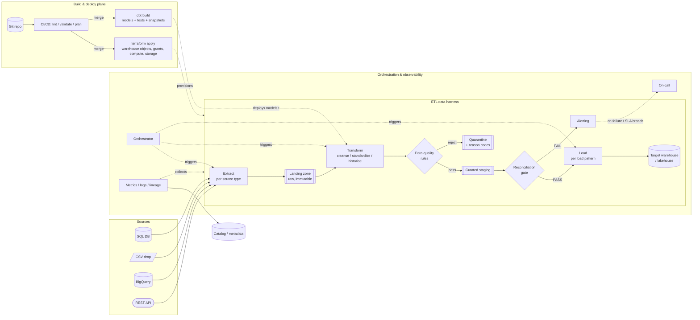

# Architecture diagram

> Mermaid. One readable screen. Replace the skeleton with the real components,
> source types, and target from the requirements. Label edges with what flows.

## System context

## Notes

- **Zones:** landing = exact source bytes/rows; curated staging = post-transform,
  pre-publish; target = consumer-facing.
- **The reconciliation gate is hard:** a FAIL never writes `_SUCCESS` and never
  publishes to the target.
- **Two planes, two cadences:** the data pipeline runs on a schedule; the build &
  deploy plane runs on a git merge. `terraform apply` provisions the harness's
  infrastructure; `dbt build` ships the transformation models. Detail in
  `deployment-and-iac.md` and `transformation-design.md`.
- Adjust source nodes to the actual set in `01-source-systems.md`; drop planes
  that requirements put out of scope.
