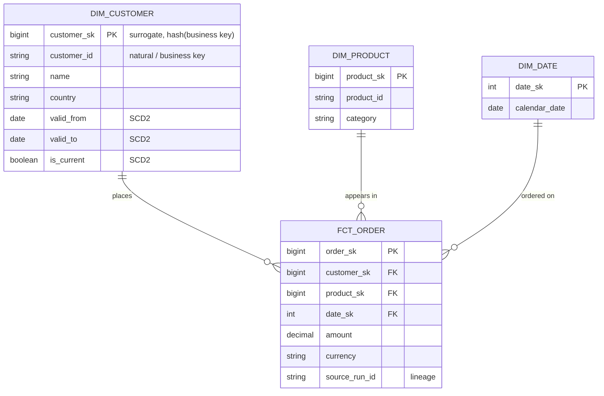
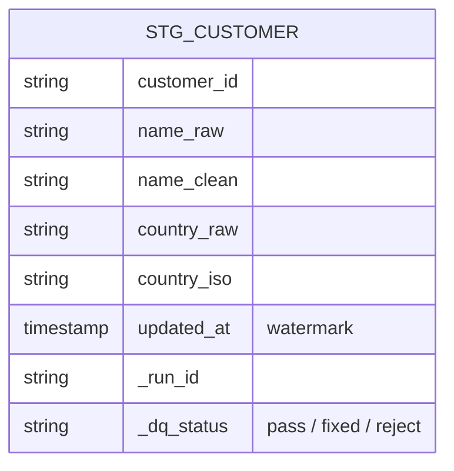

# Data-entity diagram (ER)

> Mermaid `erDiagram`. Model the **target** first (dimensions/facts or normalised
> entities), then the key **staging** entities. Entity and attribute names must
> match `02-targets-and-loading.md` and `03-transformations.md`.

## Target model

## Staging entities

## Notes

- **Keys:** business key vs surrogate key strategy (from 02/03).
- **Historisation:** which entities are SCD2 and the tracked columns (from 03).
- **Lineage columns:** `_run_id` / `source_run_id` carried into curated per 06.
- **Grain:** state the grain of every fact table explicitly.
