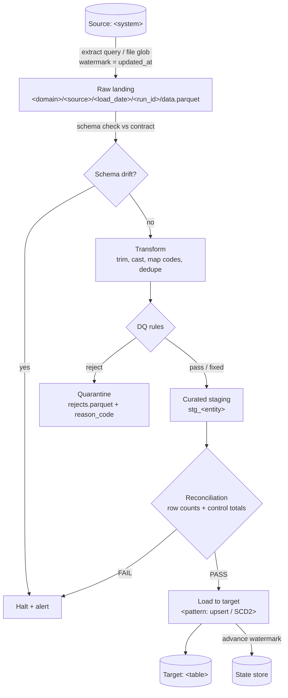

# Data-flow diagram

> How data moves through the zones, per source. One diagram per source (or a
> combined one if they are similar). Show batch vs stream and where the DQ and
> reconciliation checkpoints sit.

## Source: `<slug>` - `<mode>` (`full` / `incremental` / `cdc` / `file-arrival`)

## Zone contract

| Zone | Contents | Mutability | Retention |
|------|----------|-----------|-----------|
| Raw landing | exact source rows, as landed | immutable, new run_id per replay | from 02 |
| Quarantine | rejected rows + reason codes | append | from 04 |
| Curated staging | transformed, DQ-passed, pre-publish | replaced per run | short |
| Target | consumer-facing model | per load pattern | from 02 |

## Checkpoints

- **Schema drift check:** after landing, before transform - policy: fail / warn / evolve
- **DQ checkpoint:** during/after transform - routes rows pass / fix / quarantine / reject
- **Reconciliation checkpoint:** after staging, before load - hard gate
