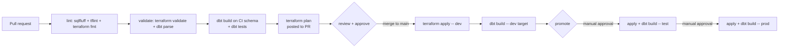

# Deployment & Infrastructure as Code

> Phase 2 deliverable. How every environment is provisioned and how code and
> config reach prod. Assumed to be Terraform + a CI/CD pipeline unless
> `10-platform-and-deployment.md` says otherwise. Every choice carries a
> "because <requirement>".

- **Project:**
- **IaC tool & version:** Terraform `x.y` / OpenTofu / Pulumi / CDK - because `10`
- **CI/CD tool:** GitHub Actions / GitLab CI / Azure DevOps / ... - because `10` / `09`

## 1. What IaC owns vs what it does not

| Managed by IaC | Managed elsewhere |
|----------------|-------------------|
| warehouse databases / catalogs / schemas | tables & views (dbt) |
| roles, grants, service principals | row/column policies tied to data (dbt / warehouse SQL) |
| compute (warehouses / clusters / job compute) | ad-hoc break-glass grants (logged, time-boxed) |
| storage buckets / external locations | landed data objects |
| secret scopes / stores (containers, not values) | secret *values* (rotated in the secret manager) |
| orchestrator infra (`07`) | DAG/job *definitions* (orchestrator repo) |
| CI runners, OIDC roles, monitoring/alerting | |

Adjust to the requirements - state anything deliberately left as click-ops and why.

## 2. Module layout

```
infra/
  modules/
    warehouse/        # catalogs, schemas, grants, compute
    storage/          # buckets, external locations, lifecycle
    orchestrator/     # the tool from area 07
    observability/    # dashboards, alert routes
    ci/               # OIDC roles, runner perms
  envs/
    dev/   main.tf  variables.tf  <env>.tfvars  backend.tf
    test/  ...
    prod/  ...
```

- **Own modules vs registry modules:** _choice_
- **Providers:** `<engine>`, `aws` / `google` / `azurerm`, `dbtcloud`, ... with
  version pins - because `10`

## 3. State & isolation

- **Backend:** S3+DynamoDB / GCS / Azure Blob / Terraform Cloud - encryption,
  locking - because `08` / `10`
- **Isolation:** one state file per env (`envs/<env>`) / workspaces - because `09`
  environment separation
- **Naming across envs:** `<env>_` prefix / separate accounts / tags - because `10`

## 4. Deployment pipeline



| Stage | Trigger | Gate to pass | Artefact |
|-------|---------|--------------|----------|
| lint / validate | every push | fmt clean, parse OK | - |
| CI dbt build | PR | all dbt tests green on CI schema | dbt `manifest.json` |
| terraform plan | PR | no destroy of stateful resources without label | plan file |
| apply + build (dev) | merge to main | plan applies clean | git SHA |
| promote test | manual approval | dev healthy, recon PASS | same SHA + manifest |
| promote prod | manual approval + change window | test healthy | same SHA + manifest |

- **Slim CI:** `dbt build --select state:modified+ --defer --state <prod manifest>`
  - because `10`.
- **Secrets in CI:** OIDC federation to the cloud / stored CI secrets / vault -
  reference scheme, no values - because `08`.

## 5. Promotion & versioning

- **What is promoted:** the exact git SHA + its dbt `manifest.json` (never a
  rebuild per env) - because `09` reproducibility.
- **Version tags:** `vMAJOR.MINOR.PATCH` on prod releases.
- **Config per env:** `<env>.tfvars` + dbt `--target <env>` + env vars; no code
  differences between envs.

## 6. Rollback

| Scenario | Action | Data impact |
|----------|--------|-------------|
| Bad dbt model | revert PR, redeploy previous SHA; `--full-refresh` affected marts | rebuilt from raw |
| Bad infra change | `terraform apply` previous SHA | - |
| Bad publish already consumed | warehouse time-travel / restore to snapshot; blue-green schema swap | per `02` rollback |

## 7. Drift & environment health

- **Drift detection:** scheduled `terraform plan` (cadence) / Terraform Cloud /
  driftctl - alerts to `07` channel.
- **Post-deploy checks:** smoke `dbt build --select <canary>`, freshness, recon
  gate green.

## 8. Environment topology

| Env | Warehouse account / workspace | Catalog / database | Compute | Access | Network |
|-----|-------------------------------|--------------------|---------|--------|---------|
| dev | | | | | |
| test | | | | | |
| prod | | | | | |

## 9. Open questions

| Q# | Impact on deployment / IaC |
|----|----------------------------|
| | |
