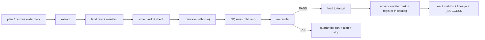

# Pipeline blueprint

> The runnable shape of one pipeline: the task DAG, its policies, and the gates.
> Repeat the DAG section per distinct pipeline pattern.
>
> This is the **data pipeline** (runs on a schedule). The **deploy pipeline**
> (`terraform plan/apply` + `dbt build` on merge, promotion dev -> test -> prod)
> lives in `deployment-and-iac.md`. Where the project is ELT-on-warehouse with
> dbt, the `transform` + `DQ rules` tasks below are a single `dbt build --select
> <selector> --target <env>` step (run + test + snapshot); reconciliation is
> singular dbt tests or a dedicated step after it.

## Pipeline: `<name>`  (source(s): `<slugs>`, cadence: `<cron/event>`)

## Task table

| Task | Depends on | Retry (transient) | On permanent failure | Idempotent? |
|------|-----------|-------------------|----------------------|-------------|
| plan | - | 3 / expo | stop | yes |
| extract | plan | 3 / expo | stop + alert | yes (per partition) |
| land raw | extract | 2 | stop | yes (new run_id) |
| schema check | land raw | 0 | fail / warn / evolve (policy) | yes |
| transform | schema check | 1 | stop | yes |
| DQ rules | transform | 0 | stop if > threshold | yes |
| reconcile | DQ rules | 0 | **block publish** + alert | yes |
| load | reconcile PASS | 2 | stop + alert | yes (per load pattern) |
| finalize | load | 1 | manual | yes |

## Policies

- **Trigger:** schedule / file sensor / upstream dependency
- **Backfill:** `<command / params>` - re-runs a `[from, to]` window, one run_id
  per window, watermark untouched until each window reconciles
- **Concurrency:** max parallel runs; per-partition parallelism
- **The reconciliation gate:** FAIL => no `_SUCCESS`, no publish, pipeline exits
  non-zero, alert fires
- **Alert points:** extract failure, schema drift (if policy=fail), DQ over
  threshold, reconciliation FAIL, SLA breach
