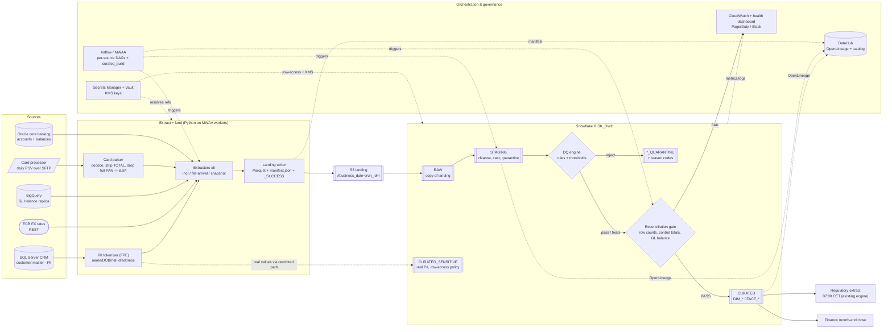

# Architecture diagram - Meridian Trust (DEMO)

> Produced by `/design-architecture` on 2026-09-03. Mermaid renders on GitHub and
> in Claude artifacts; paste into mermaid.live to edit visually.

## System context

## Notes

- **Zones:** `S3 landing`/`RAW` = exact source content (Parquet); `STAGING` =
  cleansed + quarantined; `CURATED` = consumer-facing model; `CURATED_SENSITIVE`
  = real PII only, separate restricted load path.
- **The reconciliation gate is hard** (`05`): FAIL ⇒ no `CURATED` swap, no
  `_SUCCESS`, business date stays open, PagerDuty Sev2.
- **Full PAN** exists only in memory inside the card parser; it is never written
  to landing, RAW, or anywhere else (`08`).
