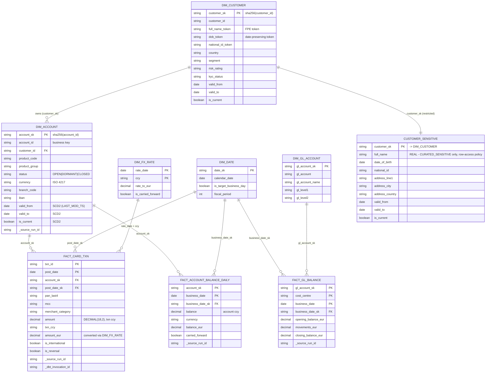
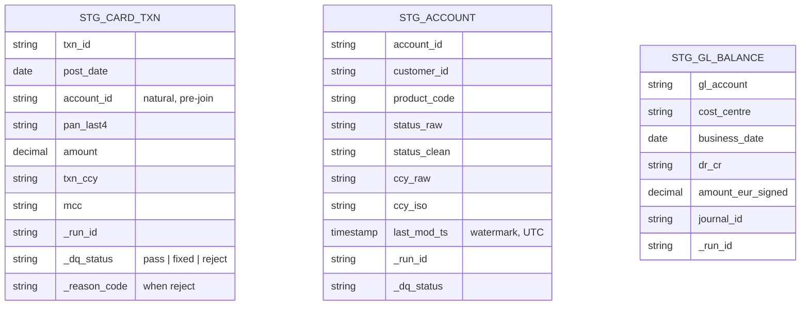

# Data-entity diagram - Meridian Trust (DEMO)

> Produced by `/design-architecture` on 2026-09-03. Entity/attribute names match
> `../requirements/02-targets-and-loading.md` and `03-transformations.md`.

## CURATED model (target)

## Key STAGING entities

## Notes

- **Grain:** `FACT_CARD_TXN` = one card transaction (`txn_id`, `post_date`);
  `FACT_ACCOUNT_BALANCE_DAILY` = one account per business date;
  `FACT_GL_BALANCE` = one GL account / cost centre per business date.
- **SCD2** on `DIM_ACCOUNT`, `DIM_CUSTOMER`, `CUSTOMER_SENSITIVE` (`03`).
- **Lineage columns** `_source_run_id` / `_dbt_invocation_id` on every fact and
  dim (`06`).
- `CUSTOMER_SENSITIVE` lives in `CURATED_SENSITIVE`, 1:1 with `DIM_CUSTOMER` on
  `customer_sk`, behind a Snowflake row-access policy (`08`).
