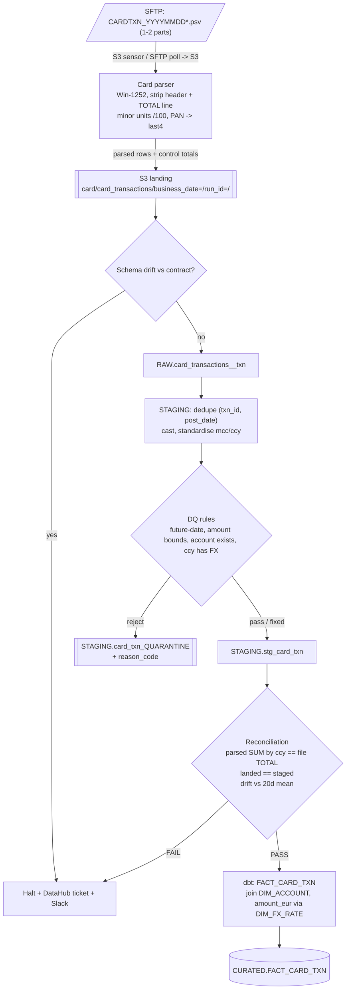
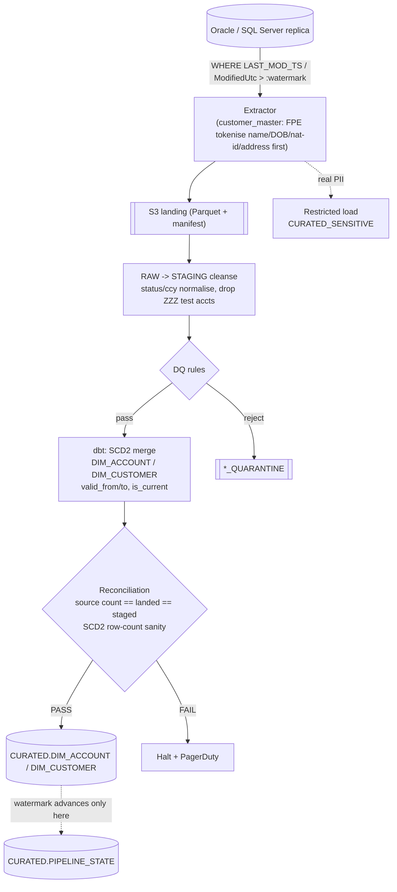
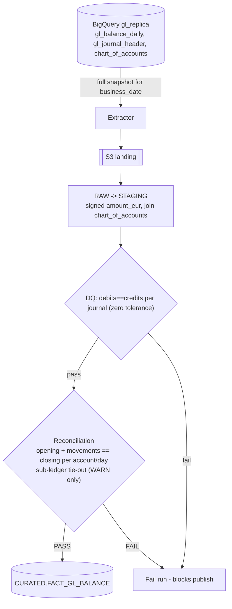
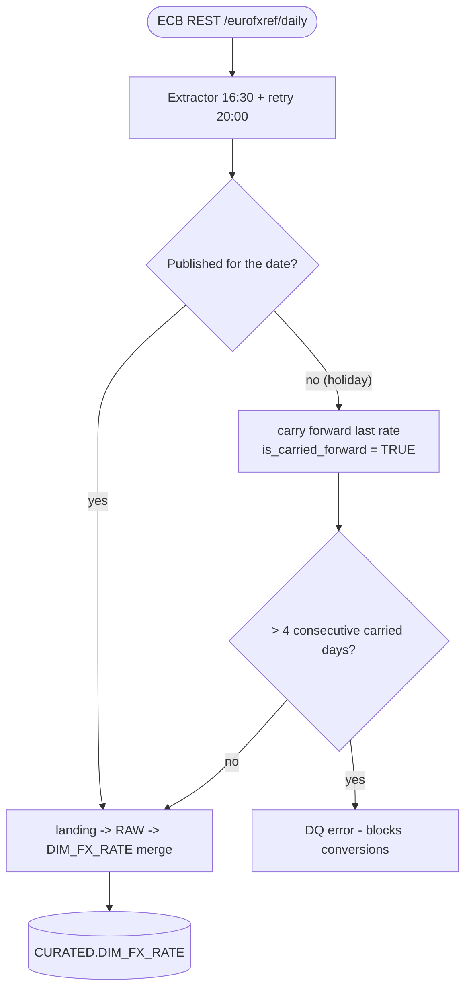

# Data-flow diagram - Meridian Trust (DEMO)

> Produced by `/design-architecture` on 2026-09-03. One diagram per source shape.

## Card transactions - file-arrival

## Core banking & customer master - incremental (watermark)

## GL balances - daily snapshot

## FX rates - reference (carry-forward)

## Zone contract

| Zone | Contents | Mutability | Retention |
|------|----------|-----------|-----------|
| S3 landing / `RAW` | exact source rows as landed (Parquet) | immutable; new `run_id` per replay | 90 days |
| `STAGING` + `*_QUARANTINE` | cleansed rows; rejects + reason codes | replaced per run | 30 days |
| `CURATED` | consumer-facing dimensional model | per load pattern (`02`) | 7 years |
| `CURATED_SENSITIVE` | real PII keyed by `customer_sk` | SCD2 like `DIM_CUSTOMER` | 7 years, crypto-shred on erasure |

## Checkpoints

- **Schema-drift:** after landing, before RAW load - policy: **fail** for
  regulated feeds, **warn** for reference data.
- **DQ:** at STAGING - routes rows pass / fix / quarantine / reject (`04`).
- **Reconciliation:** after STAGING, before the `CURATED` swap - **hard gate** (`05`).
