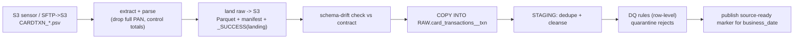
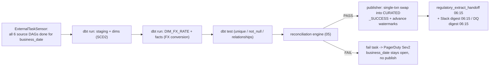

# Pipeline blueprint - Meridian Trust (DEMO)

> Produced by `/design-architecture` on 2026-09-03.

## DAG: per-source (example: `card_transactions_daily`)

## DAG: `curated_build` (gated aggregate)

## Task table (`curated_build`)

| Task | Depends on | Retry (transient) | On permanent failure | Idempotent? |
|------|-----------|-------------------|----------------------|-------------|
| wait-for-sources | schedule 04:15 | sensor reschedule to 05:30 | SLA-miss alert, stop | yes |
| dbt staging+dims | wait-for-sources | 1 | stop | yes (`business_date` keyed) |
| dbt fx+facts | dbt staging+dims | 1 | stop | yes (pre-delete then insert) |
| dbt test | dbt fx+facts | 0 | stop, no publish | yes |
| reconcile | dbt test | 0 | **stop, no publish**, PagerDuty | yes (read-only) |
| publish | reconcile PASS | 1 (txn) | stop, watermark unchanged | yes (replace) |
| handoff + digests | publish | 2 | manual re-trigger | yes |

## Policies

- **Trigger:** time schedule for 5 DAGs; S3/SFTP sensor for cards; `curated_build`
  by ExternalTaskSensor on all source DAGs for the `business_date`.
- **Backfill:** `etl backfill <source> --from <d1> --to <d2>` then
  `curated_build --business-date <d>` per date, oldest first; new `run_id` each
  time; **watermark not advanced during backfill** (`02`). Go-live: 13 months of
  cards + balances over a weekend on an `L` warehouse, then resume schedule.
- **Concurrency:** one `curated_build` run at a time (`max_active_runs=1`);
  per-source extract parallelism up to 4 file parts / partitions.
- **The reconciliation gate:** hard FAIL ⇒ no `CURATED` swap, no `_SUCCESS`,
  Airflow task fails, business date "open", PagerDuty Sev2. No auto-retry of
  reconcile - needs a human decision (fix / accept documented break with
  sign-off / re-run).
- **Alert points:** card file late at 03:30; schema drift on a regulated feed;
  DQ over threshold; reconciliation FAIL; SLA deadline 06:00 missed; FX carried
  > 4 days; quarantine table growth > 2× trailing mean.
- **SLA chain:** sources staged by 03:30-04:00 → `curated_build` 04:15 →
  CURATED PASS + auto-publish by ~05:30 → same-day human review by 09:00 (`99`
  Q2 resolved) → regulatory handoff 06:15 → reg engine 07:00.
