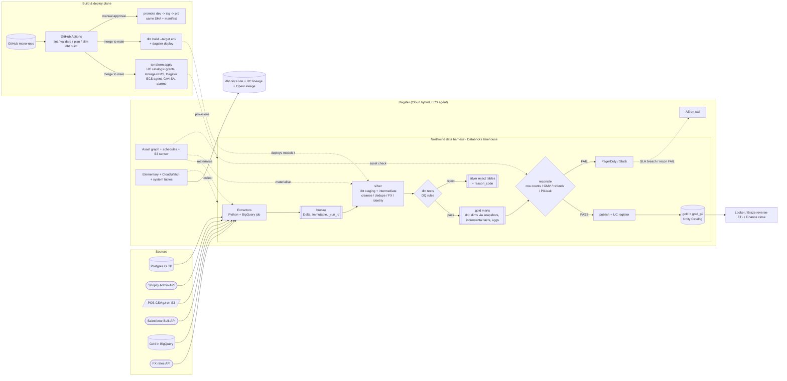

# Architecture diagram - Northwind Commerce (DEMO)

> Mermaid. System context: 6 sources -> extractors -> Databricks lakehouse
> (bronze/silver/gold) -> reconciliation gate -> gold -> consumers, with the
> Dagster control plane and the Terraform + GitHub Actions build/deploy plane.

## System context

## Notes

- **Zones:** `bronze` = exact source rows/bytes as landed (60-day retention);
  `silver` = dbt-transformed, DQ-checked, pre-publish; `gold` / `gold_pii` =
  consumer-facing, published only after reconcile PASS.
- **The reconciliation gate is hard:** implemented as a blocking Dagster asset
  check over singular dbt tests + a Python manifest compare. A FAIL means
  `publish` and `catalog_register` never materialise and the run exits non-zero.
- **Two planes, two cadences:** the data pipeline runs on Dagster schedules /
  the S3 sensor and must publish by 06:00 UTC; the build & deploy plane runs on
  a GitHub merge - `terraform apply` provisions infra, `dbt build` ships models,
  promotion is manual dev -> stg -> prd. See
  [`deployment-and-iac.md`](deployment-and-iac.md).
- **PII:** `silver` hashes email/phone; real values flow only into `gold_pii`,
  which UC governs with a row filter + column mask.
