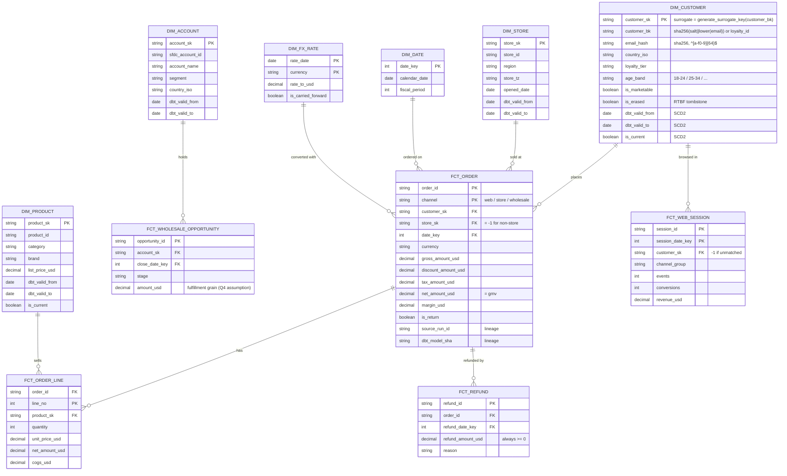
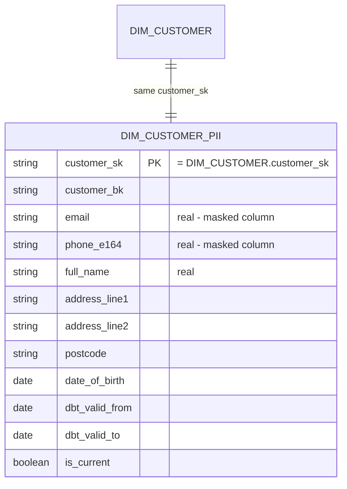
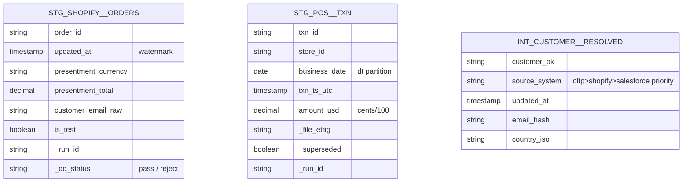

# Data-entity diagram (ER) - Northwind Commerce (DEMO)

> Mermaid `erDiagram`. `gold` target model first, then `gold_pii`, then key
> `silver` staging entities. Names match `02-targets-and-loading.md` and
> `03-transformations.md`.

## gold target model

## gold_pii (restricted - UC row filter + column mask)

## Key silver staging entities

## Notes

- **Keys:** all dims use a hashed-business-key surrogate
  (`dbt_utils.generate_surrogate_key`); every dim seeds an unknown-member row
  `_sk = -1`. Facts carry natural keys + resolved `_sk`s.
- **Grain:** `FCT_ORDER` = one order per channel; `FCT_ORDER_LINE` = order line;
  `FCT_REFUND` = refund; `FCT_WEB_SESSION` = session per session_date;
  `FCT_WHOLESALE_OPPORTUNITY` = opportunity at fulfillment grain (Q4).
- **Historisation:** `DIM_CUSTOMER/PRODUCT/STORE/ACCOUNT` are SCD2 via dbt
  snapshots; `DIM_FX_RATE` is upsert; facts are not versioned (late corrections
  `merge` on key).
- **Lineage columns:** `source_run_id` + `dbt_model_sha` carried into every fact
  per `06`.
