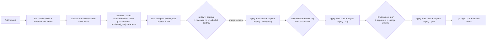

# Deployment & Infrastructure as Code - Northwind Commerce (DEMO)

> Phase 2 deliverable. Every choice carries a "because <requirement>".

- **Project:** Northwind Commerce
- **IaC tool & version:** Terraform 1.9 (state in S3) - because `10` ("if it's
  not in Terraform it doesn't exist"); OpenTofu is an accepted drop-in fallback
- **CI/CD tool:** GitHub Actions with self-hosted runners on the ECS cluster -
  because `10` + `09` (runners need VPC access to reach `prd`)

## 1. What IaC owns vs what it does not

| Managed by Terraform | Managed elsewhere |
|----------------------|-------------------|
| UC catalogs (`northwind_<env>`), schemas (`bronze/silver/gold/gold_pii`), grants | Delta tables / views / snapshots / seeds (dbt) |
| `gold_pii` UC row filter (marketable-consent) + column mask + `northwind_pii_readers` group | row/column policy *logic* refined in dbt post-hooks where data-dependent |
| External locations + storage credentials; S3 buckets (inbound, lakehouse, tfstate, dbt-docs) + lifecycle + SSE-KMS keys | landed data objects; `_manifests`, `_recon` payloads (pipeline) |
| Databricks service principals, job compute policies, secret scopes + ACLs | secret **values** (rotated in AWS Secrets Manager) |
| Dagster Cloud ECS agent: VPC lookups, ECS service + task role, ALB, autoscaling | Dagster asset / job / schedule / sensor definitions (`dagster/`, deployed by CI) |
| GA4 reader GCP service account + BigQuery IAM bindings | GA4 export config in GA4 itself |
| GitHub OIDC role (`northwind-<env>-ci`), runner IAM | GitHub repo settings, Environment reviewers (repo admin) |
| CloudWatch alarms, SNS topics, PagerDuty service wiring | PagerDuty escalation policy (owned by SRE) |

Deliberate click-ops: the Databricks workspace + UC metastore per env (platform
team, upstream of this harness) and break-glass grants (manual, time-boxed,
logged). - because `10` assumptions.

## 2. Module layout

```
infra/
  modules/
    warehouse/        # UC catalog, schemas, grants, gold_pii row filter + column mask + reader group, SPs, job compute policy
    storage/          # S3 buckets + lifecycle + SSE-KMS, external locations, storage credentials
    orchestrator/     # Dagster Cloud ECS agent: ECS service, task role, ALB, SG; var 'mode' = cloud_agent | oss_selfhost (Q3 fallback)
    ga4/              # GCP service account + BigQuery Data Viewer / Job User bindings
    ci/               # GitHub OIDC provider + role, runner instance profile
    observability/    # CloudWatch alarms (cost, freshness, SLA), SNS -> PagerDuty/Slack
  envs/
    dev/   backend.tf  main.tf  dev.tfvars
    stg/   backend.tf  main.tf  stg.tfvars
    prd/   backend.tf  main.tf  prd.tfvars
```

- **Own modules** for everything above; **registry module** `terraform-aws-vpc`
  for networking lookups only.
- **Providers (version-pinned):** `databricks ~> 1.50`, `aws ~> 5.60`,
  `google ~> 5.40`. - because `10`.

## 3. State & isolation

- **Backend:** `s3://northwind-<env>-tfstate` (versioned, SSE-KMS CMK) +
  DynamoDB `northwind-tf-lock` for locking - because `08` (encryption) / `10`.
- **Isolation:** one state file per env in `infra/envs/<env>` (directory-per-env,
  no workspaces) - because `09` environment separation; `prd` state lives in the
  dedicated `prd` AWS account.
- **Naming across envs:** `northwind_<env>` catalog, `northwind-<env>-*` for AWS
  resources; identical schema/table names in every catalog - because `10`.

## 4. Deployment pipeline



| Stage | Trigger | Gate to pass | Artefact |
|-------|---------|--------------|----------|
| lint / validate | every push | fmt clean, `dbt parse` + `terraform validate` OK | - |
| CI dbt build | PR | all dbt tests green on the throwaway CI schema | dbt `manifest.json` |
| terraform plan | PR | no destroy of a stateful resource without a `destroy-ok` label | plan files (dev/stg/prd) |
| apply + build (dev) | merge to `main` | plan applies clean; `curated_build` canary green | git SHA |
| promote stg | manual approval (Environment `stg`) | dev healthy, reconcile PASS on last run | same SHA + manifest |
| promote prd | 2 approvers + Tue/Thu change window (or `hotfix` label) | stg healthy 24h | same SHA + manifest |

- **Slim CI:** `dbt build --select state:modified+ --defer --state <prd manifest>`
  - because `10`.
- **Secrets in CI:** GitHub OIDC -> `northwind-<env>-ci` AWS role; Databricks +
  Dagster deploy tokens in per-env GitHub Environment secrets. No stored cloud
  keys. - because `08`.

## 5. Promotion & versioning

- **What is promoted:** the exact git SHA **and** its dbt `manifest.json` -
  never a per-env rebuild - because `09` reproducibility.
- **Version tags:** `vMAJOR.MINOR.PATCH` on every prd release; notes generated
  from merged PRs.
- **Config per env:** `<env>.tfvars` + `dbt --target <env>` + Dagster deployment
  name; no code differences between envs - because `10`.

## 6. Rollback

| Scenario | Action | Data impact |
|----------|--------|-------------|
| Bad dbt model | revert PR, redeploy previous SHA, `dbt build --full-refresh --select <affected>+ --target prd` | affected marts rebuilt from `bronze`/`silver` |
| Bad infra change | `terraform apply` the previous SHA in `infra/envs/prd` | none if caught before dependent runs |
| Bad publish already consumed | `RESTORE gold.<table> TO VERSION AS OF <n>` (Delta time-travel), then rebuild the business date | consumers briefly see the prior good version |
| Region / account loss | promote the weekly `eu-west-2` deep-clone read-only while rebuilding | RPO 24h, RTO 4h (`09`) |

## 7. Drift & environment health

- **Drift detection:** nightly `terraform plan` per env in GitHub Actions; a
  non-empty plan posts to `#northwind-platform` and opens an issue - because
  `10`.
- **Post-deploy checks:** `dbt build --select tag:canary`, `dbt source
  freshness`, reconcile asset check green; a failed post-deploy check auto-rolls
  back dev and blocks promotion.

## 8. Environment topology

| Env | Workspace / AWS acct | UC catalog | Compute | Access | Network |
|-----|----------------------|------------|---------|--------|---------|
| dev | `northwind-dev` / shared acct | `northwind_dev` | job compute 1-2 spot workers | all engineers | shared VPC, public control plane |
| stg | `northwind-stg` / shared acct | `northwind_stg` | job compute 1-4 workers | engineers + release approvers | shared VPC |
| prd | `northwind-prd` / dedicated locked acct | `northwind_prd` | job compute 1-4 + photon on `curated_build`; on-demand backfill pool | pipeline SP + named on-call + read-only consumers | customer-managed VPC, no public ingress, S3 gateway endpoint, VPC peering to Postgres replica |

## 9. Open questions

| Q# | Impact on deployment / IaC |
|----|----------------------------|
| Q3 | `orchestrator/` module `mode` variable: `cloud_agent` (default) vs `oss_selfhost` (Dagster webserver + daemon ECS services). Asset code and the rest of the pipeline are unchanged. |
| Q2 | backfill runs on the `prd` on-demand pool; 12 vs 24 months only changes runtime + spend, not the modules. |
